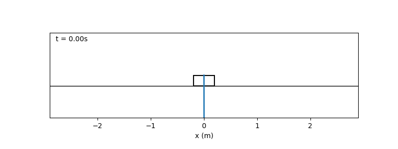
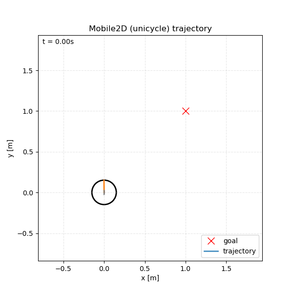
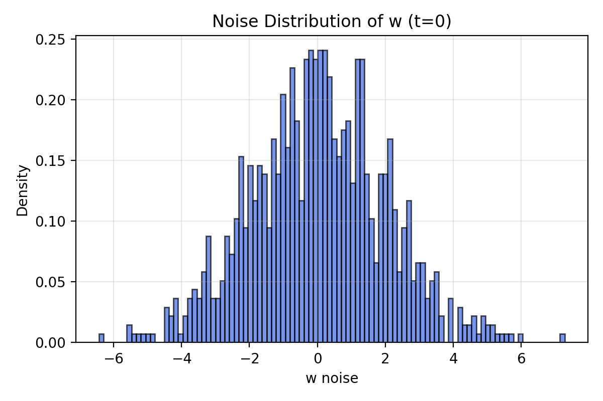
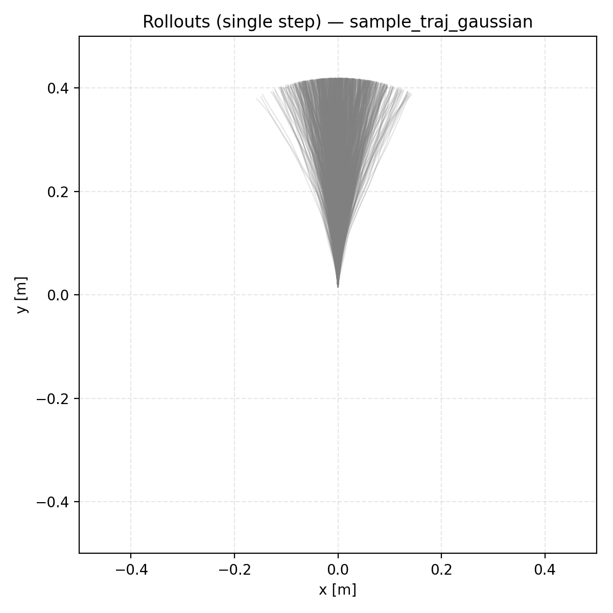
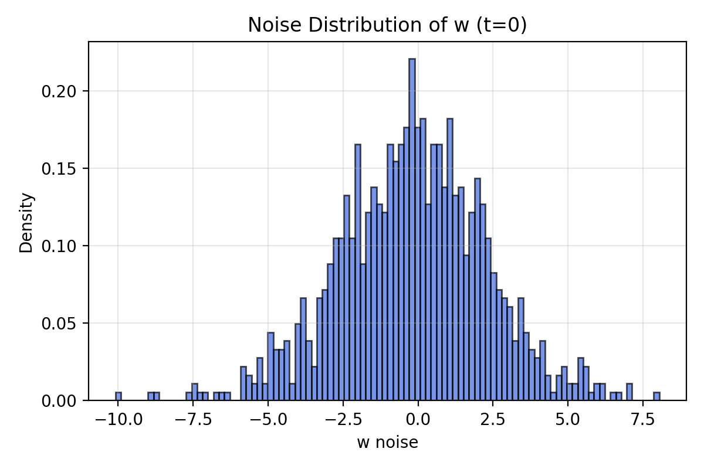
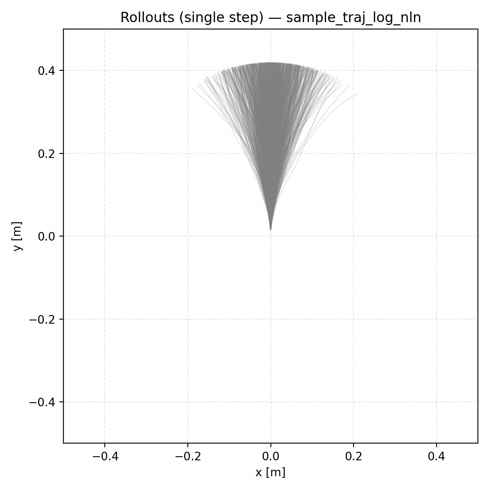
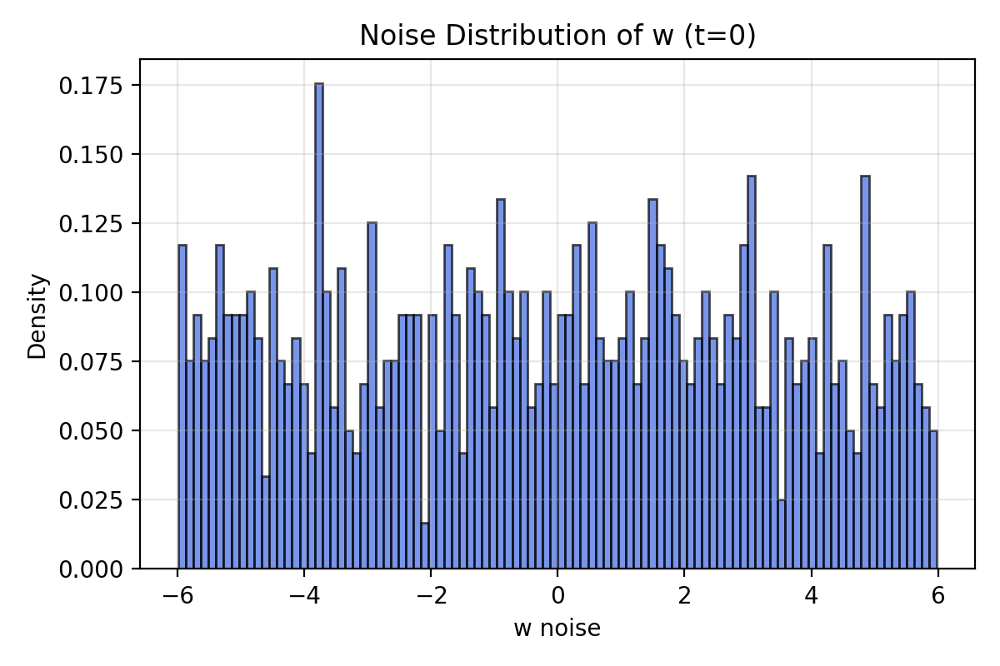
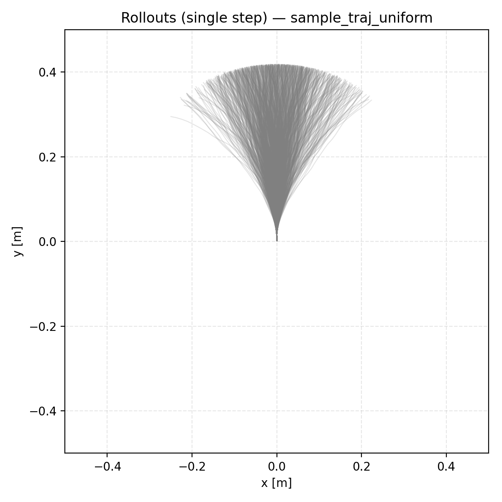

  # MPPI Tutorial
  This repository provides lecture materials, example code, and tutorial videos for a **3-session introduction to Model Predictive Path Integral (MPPI) control**.
  The tutorial is designed for an graduate mobile robotics course.

  If you want to use the MPPI implementation for a ROS2-based manipulator, please switch to the mppi_ros2 branch.

  ---

  ## 📚 Tutorial Structure (3 Sessions)

  1. **Session 1 — Essential Concepts for Understanding MPPI** 👉 **[Session 1](https://youtu.be/u8wPyTtI8as)**
  2. **Session 2 — MPPI Algorithm Explanation and Derivtation** 👉 **[Session 2](https://youtu.be/w_NsuKs25Z8)**
  3. **Session 3 — Code Walkthrough and Practical Implementation** 👉 **[Session 3](https://youtu.be/-9ET4rlpoz8)**


  ### 📄 Lecture Materials (Google Drive)

The original PPT files are too large to be uploaded to GitHub, so the lecture materials are provided through Google Drive instead.

👉 **[Download the MPPI Tutorial Lecture Materials (PPT)](https://drive.google.com/drive/folders/1d8BNSHpyymQ3jF-sdPVYpribDgkNTpzT?usp=sharing)**  

  ---
  # ⚙️ Environment Setup

  Below is the recommended environment configuration for running the MPPI tutorial examples.

  ### 1) Create & Activate Conda Environment

  ```bash
  conda create -n mppi_tutorial python=3.10
  conda activate mppi_tutorial
  ```

  ### 2) Install Dependencies

  ```bash
  conda install matplotlib
  conda install pytorch=2.5.1 torchvision pytorch-cuda=11.8 -c pytorch -c nvidia

  ```

  ---

  # 🚀 Running the Example Code

  ```bash
  git clone <repository_url>
  cd <repository_name>

  python3 examples/quadrotor3d_run.py
  ```

  ---

  # 🎥 MPPI Demo Examples

|  |
|:-------------------------:|

|  |  |
|------------------------------------|----------------------------------|


  ---

  # 📊 Visualization Results
  | **Gaussian distribution** |  |  |
|-----------|------------------------|------------------------|
| **Normal-logNormal distribution** |  |  |
| **Uniform distribution** |  |  |

